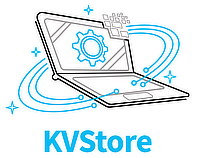

<p align="center">


[](https://godoc.org/github.com/rasteric/kvstore)
[](https://goreportcard.com/report/github.com/rasteric/kvstore)
</p>

__KVStore is an Sqlite3-backed embedded local key value store for Go, focusing on simplicity and data integrity. It currently hardcodes the CGO-free Sqlite3 library `github.com/ncruces/go-sqlite3` in WAL mode as backend.__

## Installation

`go get https://github.com/rasteric/kvstore`

Development takes place at the main branch so you need to make sure to always get a release, not the current state of `main`.

## Quick Start 

```go
package main

import (
	"errors"
	"fmt"
	"log"
	"os"

	"github.com/rasteric/kvstore"
)

func main() {
	db := kvstore.New()
	path, err := os.MkdirTemp("", "kvstore-test")
	if err != nil {
		panic(err)
	}
	err = db.Open(path)
	if err != nil {
		panic(err)
	}
	// make sure the test dir is cleaned up afterwards
	defer func() {
		err := db.Close()
		if err != nil {
			log.Println(err)
		}
		os.RemoveAll(path)
	}()

	// checking a key value pair doesn't exist
	if _, err := db.Get("hello"); errors.Is(err, kvstore.NotFoundErr) {
		fmt.Println(`there is no key "hello"`)
	} else {
		fmt.Println(err)
	}

	// setting a key value pair
	err = db.Set("example", "hello world!")
	if err != nil {
		panic(err)
	}

	// getting the value for a key
	s, err := db.Get("example")
	if err != nil {
		panic(err)
	}
	fmt.Println(s)

	// setting a default and key info
	err = db.SetDefault("example", "have a nice day!",
        kvstore.KeyInfo{Description: "an example key",
		Category: "testing"})
	if err != nil {
		panic(err)
	}

	// reverting a key value to its default
	if err := db.Revert("example"); err != nil {
		panic(err)
	}

	s, _ = db.Get("example")
	fmt.Println(s)
}
```

See the tests for more examples. Notice that `kvstore.NotFoundErr` is returned when a `get` operation fails. Since all kinds of errors can occur with file-based databases, this API was chosen instead of the more common `value, ok:=db.Get(key)` from maps and other key value stores. Check for the error with `errors.Is(err,kvstore.NotFoundErr)` to distinguish it from other errors. Use `SetDefault` to set a default, in case of which the default is returned if no value was set.

## Documentation

All API calls are in the following interface:

```go
type KeyValueStore interface {
	Open(path string) error                   // open the database at directory path
	Close() error                             // close the database
	Set(key string, value any) error          // set the key to the given value, which must be gob serializable
	Get(key string) (any, error)              // get the value for key, NotFoundErr if there is no key
	SetMany(map[string]any) error             // set all key-value pairs in the map in one transaction
	GetAll(limit int) (map[string]any, error) // get all key-value pairs as a map
	Revert(key string) error                  // revert key to its default
	Info(key string) (KeyInfo, bool)          // returns key information for a key if it is present
	Delete(key string) error                  // remove the key and value for the key
	DeleteMany(keys []string) error           // remove all the given keys in one transaction
	SetDefault(key string,                    // set a default and info for a key
		value any,
		info KeyInfo) error
}
```

The `path` argument to `Open` needs to be a directory whose name is the name you wish the database to have. This is so because the a key-value store may write more than one file, for example the write-ahead log in addition to the database. The actual sqlite database s called `kvstore.sqlite` in the default implementation.

## Endoding

This library uses Go's gob encoding to encode values in the database. This means that you have to use `gob.Register(mystruct{})` if you want to store values of custom struct `mystruct` in the key value database. It also means that all limitations of gob encoding apply to the values stored.

## License

This library is MIT licensed and free for commercial and personal use as long as the license conditions are satisfied. See the accompanying LICENSE file for more information.
